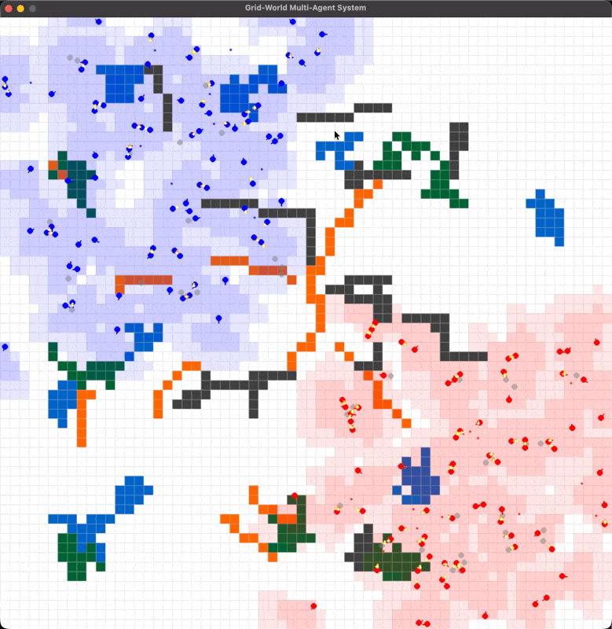

# combatenv - Multi-Agent Tactical Combat Environment

A Pygame-based tactical combat simulation featuring 200 autonomous agents engaged in team-based combat within a 64x64 grid world. Built as a Gymnasium-compatible reinforcement learning environment.



## Table of Contents

- [Overview](#overview)
- [Features](#features)
- [Installation](#installation)
- [Quick Start](#quick-start)
- [Usage](#usage)
- [Controls](#controls)
- [Game Mechanics](#game-mechanics)
- [Project Structure](#project-structure)
- [Configuration](#configuration)
- [Testing](#testing)
- [Documentation](#documentation)

## Overview

This simulation creates a tactical environment where two teams (blue and red, 100 agents each) autonomously navigate, detect enemies, and engage in projectile-based combat. The system features:

- **Gymnasium API**: Standard RL environment interface (`reset()`, `step()`, observation/action spaces)
- **Autonomous AI**: Agents wander, avoid boundaries, and engage enemies
- **Two-Layer FOV System**: Near and far vision cones with different accuracy modifiers
- **Resource Management**: Stamina, armor, and ammunition systems
- **Terrain System**: Obstacles, fire, forest, and water with unique effects
- **Spatial Optimization**: Efficient collision detection using spatial hashing

```
+---------------------------------------------------------+
|                  SIMULATION OVERVIEW                     |
+---------------------------------------------------------+
|                                                         |
|   Blue Team (100)              Red Team (100)           |
|   +-----------+                      +-----------+      |
|   |  Spawn    |                      |  Spawn    |      |
|   |  Zone     |    ============>     |  Zone     |      |
|   | (top-left)|      Combat          |(bot-right)|      |
|   +-----------+                      +-----------+      |
|                                                         |
|   64x64 Grid World  *  60 FPS  *  200 Agents            |
+---------------------------------------------------------+
```

## Features

### Gymnasium-Compatible Environment
```python
from combatenv import TacticalCombatEnv, EnvConfig

env = TacticalCombatEnv(render_mode="human")
obs, info = env.reset()

for _ in range(1000):
    action = env.action_space.sample()
    obs, reward, terminated, truncated, info = env.step(action)
    if terminated or truncated:
        obs, info = env.reset()
```

### Two-Layer Field of View
```
            Near FOV                    Far FOV
       +-------------+            +-----------------+
       |    90 deg   |            |     120 deg     |
       |   3 cells   |            |    5 cells      |
       |   90% acc   |            |    50% acc      |
       +-------------+            +-----------------+

    Agent -->  [Near FOV][    Far FOV Ring    ]
               <-- 3c -->  <------ 5c ------->
```

### Combat System
- Projectile-based shooting (15 cells/second)
- Accuracy affected by FOV layer and movement
- 0.5 second cooldown between shots
- 25 damage per hit
- Projectiles are destroyed when colliding with obstacles

### Terrain System

| Terrain | Effect | Blocks Movement | Blocks LOS |
|---------|--------|-----------------|------------|
| Empty | None | No | No |
| Obstacle | Impassable | Yes | Yes |
| Fire | 5 damage/step (bypasses armor) | No | No |
| Forest | Stuck for 3-6 steps | No | No |
| Water | Impassable | Yes | No |

### Resource Management

| Resource | Maximum | Drain Rate | Regeneration | Notes |
|----------|---------|------------|--------------|-------|
| **Stamina** | 100 | 15/sec moving | 20/sec idle, 5/sec moving | 50% speed at <20 |
| **Armor** | 100 | On damage | None (depleting) | Absorbs before health |
| **Health** | 100 | On damage | None | Agent dies at 0 |
| **Ammo** | 1000 reserve | 1/shot | 30/magazine, 2s reload | Auto-reload |

## Installation

### Prerequisites
- Python 3.8 or higher
- Pygame library
- NumPy
- Gymnasium

### Setup

1. Clone or download the project:
```bash
cd /path/to/project
```

2. Create and activate a virtual environment:
```bash
python -m venv ~/.venvs/pg
source ~/.venvs/pg/bin/activate
```

3. Install dependencies:
```bash
pip install pygame numpy gymnasium
```

## Quick Start

1. Activate the virtual environment:
```bash
source ~/.venvs/pg/bin/activate
```

2. Run the simulation:
```bash
python main.py
```

3. Watch the agents battle! The simulation runs automatically.

## Usage

### Basic Import
```python
from combatenv import TacticalCombatEnv, EnvConfig
```

### Creating an Environment
```python
# Default configuration
env = TacticalCombatEnv(render_mode="human")

# Custom configuration
config = EnvConfig(
    num_blue_agents=50,
    num_red_agents=50,
    max_steps=1000,
    terminate_on_controlled_death=True
)
env = TacticalCombatEnv(render_mode="human", config=config)
```

### Running Episodes
```python
obs, info = env.reset(seed=42)

done = False
total_reward = 0

while not done:
    action = env.action_space.sample()  # Or your policy
    obs, reward, terminated, truncated, info = env.step(action)
    total_reward += reward
    done = terminated or truncated

print(f"Episode finished with reward: {total_reward}")
```

### Accessing Game State
```python
from combatenv import Agent, TerrainType, config

# Access configuration values
grid_size = config.GRID_SIZE
damage = config.PROJECTILE_DAMAGE

# Create agents directly
agent = Agent(position=(10.0, 10.0), orientation=45.0, team="blue")
```

## Controls

| Key | Action |
|-----|--------|
| **Shift+Q** | Exit simulation |
| **` (backtick)** | Toggle debug overlay (on by default) |
| **F** | Toggle FOV overlay (on by default) |
| **? (Shift+/)** | Toggle keybindings help |

## Game Mechanics

### Agent Behavior
Agents use a simple autonomous wandering algorithm:
1. Move forward most of the time
2. Occasionally change direction randomly
3. Turn away from boundaries when approaching
4. Detect and shoot at enemies in FOV

### Combat Flow
```
+----------------------------------------------------------+
|                      COMBAT SEQUENCE                      |
+----------------------------------------------------------+
|                                                          |
|  1. Agent scans FOV  -->  2. Detect enemy  -->  3. Fire  |
|         |                       |                    |   |
|         v                       v                    v   |
|  [Near: 90%, 3 cells]    [Closest target]    [Accuracy   |
|  [Far:  50%, 5 cells]    [prioritized]        modified]  |
|                                                          |
|  4. Projectile travels  -->  5. Hit detection  -->  6.Dmg|
|         |                           |                 |  |
|         v                           v                 v  |
|  [15 cells/sec]           [Armor first]      [25 damage] |
|  [2 sec lifetime]         [Then health]      [Death at 0]|
|                                                          |
+----------------------------------------------------------+
```

### Accuracy Modifiers
Base accuracy depends on FOV layer:
- **Near FOV (3 cells, 90 deg)**: 90% accuracy
- **Far FOV (5 cells, 120 deg)**: 50% accuracy

Movement penalty:
- Moving agents suffer **50% accuracy reduction**
- Example: Moving agent with near FOV target = 90% x 50% = 45% accuracy

## Project Structure

```
/project/
├── main.py              # Entry point - runs the simulation
├── map_editor.py        # Standalone map editor for custom terrain
├── combatenv/           # Main package
│   ├── __init__.py      # Package exports
│   ├── environment.py   # TacticalCombatEnv (Gymnasium env)
│   ├── agent.py         # Agent class with movement, combat
│   ├── config.py        # All configuration constants
│   ├── projectile.py    # Projectile class and factory
│   ├── fov.py           # Field of view calculations
│   ├── spatial.py       # Spatial grid optimization
│   ├── terrain.py       # Terrain types and grid
│   ├── renderer.py      # All rendering functions
│   └── map_io.py        # Save/load maps to JSON
├── tests/               # Test suite (193 tests)
│   ├── test_agent.py
│   ├── test_environment.py
│   ├── test_terrain.py
│   └── ...
└── docs/                # Documentation
    ├── README.md        # This file
    ├── ARCHITECTURE.md  # System design
    ├── API.md           # API reference
    └── CLAUDE.md        # Development guide
```

## Configuration

All game parameters are centralized in `combatenv/config.py`. This module allows customization of game mechanics, visuals, and performance without code changes.

### Units
- **Distances**: Grid cells (1 cell = `CELL_SIZE` pixels)
- **Speeds**: Grid cells per second
- **Angles**: Degrees
- **Times**: Seconds
- **Alpha values**: 0-255 (higher = more opaque)

### Window and Grid

| Parameter | Default | Description |
|-----------|---------|-------------|
| `WINDOW_SIZE` | 1024 | Window resolution in pixels |
| `CELL_SIZE` | 16 | Size of each grid cell in pixels |
| `GRID_SIZE` | 64 | Derived: `WINDOW_SIZE / CELL_SIZE` |
| `FPS` | 60 | Target frames per second |

### Agent Configuration

| Parameter | Default | Description |
|-----------|---------|-------------|
| `NUM_AGENTS_PER_TEAM` | 100 | Number of agents per team |
| `AGENT_SIZE_RATIO` | 0.7 | Agent circle size as % of cell |
| `AGENT_NOSE_RATIO` | 0.4 | Nose line length as % of cell |

### Movement

| Parameter | Default | Description |
|-----------|---------|-------------|
| `AGENT_MOVE_SPEED` | 3.0 | Grid cells per second |
| `AGENT_ROTATION_SPEED` | 180.0 | Degrees per second |
| `WANDER_DIRECTION_CHANGE` | 0.02 | Probability of direction change per frame |

### Boundary and Collision

| Parameter | Default | Description |
|-----------|---------|-------------|
| `BOUNDARY_MARGIN` | 0.5 | Minimum distance from grid edge |
| `BOUNDARY_DETECTION_THRESHOLD` | 1.0 | Distance to trigger boundary avoidance |
| `AGENT_SPAWN_SPACING` | 1.0 | Minimum spacing between spawned agents |
| `AGENT_COLLISION_RADIUS` | 0.8 | Minimum separation distance |

### Combat - FOV Layers

| Parameter | Default | Description |
|-----------|---------|-------------|
| `NEAR_FOV_RANGE` | 3.0 | Near FOV range in cells |
| `NEAR_FOV_ANGLE` | 90.0 | Near FOV cone angle in degrees |
| `NEAR_FOV_ACCURACY` | 0.99 | 99% accuracy in near FOV |
| `FAR_FOV_RANGE` | 5.0 | Far FOV range in cells |
| `FAR_FOV_ANGLE` | 120.0 | Far FOV cone angle in degrees |
| `FAR_FOV_ACCURACY` | 0.80 | 80% accuracy in far FOV |
| `MOVEMENT_ACCURACY_PENALTY` | 0.5 | Accuracy multiplier when moving |

### Combat - Projectiles

| Parameter | Default | Description |
|-----------|---------|-------------|
| `PROJECTILE_SPEED` | 15.0 | Grid cells per second |
| `PROJECTILE_DAMAGE` | 25 | HP damage per hit |
| `PROJECTILE_RANGE` | 10.0 | Max distance (2x far FOV range) |
| `PROJECTILE_LIFETIME` | 0.67 | Derived: range / speed |
| `PROJECTILE_RADIUS` | 0.3 | Collision detection radius |

### Combat - Agent

| Parameter | Default | Description |
|-----------|---------|-------------|
| `AGENT_MAX_HEALTH` | 100 | Maximum health points |
| `SHOOT_COOLDOWN` | 0.5 | Seconds between shots |
| `FRIENDLY_FIRE_ENABLED` | True | Allow friendly fire |
| `MUZZLE_FLASH_LIFETIME` | 0.1 | Seconds flash is visible |
| `RESPAWN_DELAY_SECONDS` | 1.0 | Delay before respawn |

### Resource Management - Stamina

| Parameter | Default | Description |
|-----------|---------|-------------|
| `AGENT_MAX_STAMINA` | 100.0 | Maximum stamina points |
| `STAMINA_REGEN_RATE_IDLE` | 20.0 | Regen per second when idle |
| `STAMINA_REGEN_RATE_MOVING` | 5.0 | Regen per second when moving |
| `STAMINA_DRAIN_RATE` | 15.0 | Drain per second of movement |
| `LOW_STAMINA_THRESHOLD` | 20.0 | Threshold for speed penalty |
| `MOVEMENT_SPEED_PENALTY_LOW_STAMINA` | 0.5 | Speed multiplier at low stamina |

### Resource Management - Armor and Ammo

| Parameter | Default | Description |
|-----------|---------|-------------|
| `AGENT_MAX_ARMOR` | 100 | Maximum armor points |
| `ARMOR_REGEN_RATE` | 0.0 | No regeneration (depleting) |
| `AGENT_MAX_AMMO` | 1000 | Total ammo reserve |
| `MAGAZINE_SIZE` | 30 | Rounds per magazine |
| `RELOAD_TIME` | 2.0 | Seconds to reload |
| `AUTO_RELOAD_ON_EMPTY` | True | Auto-reload when empty |

### Terrain

| Parameter | Default | Description |
|-----------|---------|-------------|
| `FIRE_DAMAGE_PER_STEP` | 2 | HP per step in fire (bypasses armor) |
| `TERRAIN_OBSTACLE_PCT` | 0.05 | 5% of grid |
| `TERRAIN_FIRE_PCT` | 0.02 | 2% of grid |
| `TERRAIN_FOREST_PCT` | 0.03 | 3% of grid |
| `TERRAIN_WATER_PCT` | 0.03 | 3% of grid |

### Colors

Colors are defined as RGB tuples. Key color constants:

| Parameter | Value | Description |
|-----------|-------|-------------|
| `COLOR_BACKGROUND` | (255, 255, 255) | White background |
| `COLOR_BLUE_TEAM` | (0, 0, 255) | Blue team agents |
| `COLOR_RED_TEAM` | (255, 0, 0) | Red team agents |
| `COLOR_DEAD_AGENT` | (128, 128, 128) | Gray for dead agents |
| `COLOR_OBSTACLE` | (64, 64, 64) | Dark gray obstacles |
| `COLOR_FIRE` | (255, 100, 0) | Orange fire |
| `COLOR_FOREST` | (0, 100, 50) | Dark green forest |
| `COLOR_WATER` | (0, 100, 200) | Blue water |

See `docs/API.md` for complete configuration reference.

## Testing

Run the full test suite:
```bash
source ~/.venvs/pg/bin/activate
python -m pytest tests/ -v
```

Test results: 190 passed, 1 skipped

## Documentation

- **README.md** (this file): Installation, usage, game mechanics
- **ARCHITECTURE.md**: System design, data flow diagrams, design patterns
- **API.md**: Complete configuration reference and module APIs
- **CLAUDE.md**: Claude Code development instructions

## Performance

The simulation is optimized to run at approximately 58 FPS with 200 agents and FOV visualization enabled:

### FOV Caching
The FOVCache class optimizes field of view calculations:
- Only recalculates when agent moves >0.3 cells or rotates >5 degrees
- Significantly reduces computational overhead for FOV visualization
- Cache is cleared on environment reset

### Spatial Grid Optimization
Instead of O(n^2) collision checks, the spatial grid reduces this to approximately O(n):
- Grid divided into 2x2 cell buckets
- Only nearby agents checked for collisions
- Reduces checks from ~40,000 to ~3,200 per frame

### Debug Overlay

Press **` (backtick)** to toggle the debug overlay (on by default), showing:
- Current FPS (color-coded: green >55, yellow >30, red <30)
- Agent counts (total, blue alive, red alive)
- Combat statistics (deaths, active projectiles)
- Spatial grid statistics (cells, average agents per cell)

### FOV Overlay

Press **F** to toggle the FOV visualization (on by default). Disabling FOV overlay can improve performance when not needed for debugging.

## Change Log

### v0.1.1 (2026-01-02)

**Phase 9: Documentation**
- Moved all documentation to `docs/` directory
- Created comprehensive API reference
- Added architecture documentation

**Phase 8: Package Structure**
- Organized code as `combatenv` package with public API
- Added `__init__.py` with clean exports
- Created comprehensive test suite (190 tests)

**Phase 7: Gymnasium Environment**
- Created `TacticalCombatEnv` with standard Gymnasium API
- Defined observation space (50 dimensions) and action space
- Implemented reward function and termination conditions

**Phase 6: Terrain System**
- Added TerrainType enum (EMPTY, OBSTACLE, FIRE, FOREST, WATER)
- Implemented terrain effects (fire damage, forest stuck)
- Integrated terrain with line-of-sight blocking

**Phase 5: Combat System**
- Created Projectile class with accuracy deviation
- Implemented damage system with armor/health
- Added shooting cooldowns and reload mechanics

**Phase 4: Field of View System**
- Implemented two-layer FOV (near: 3 cells/90°, far: 5 cells/120°)
- Created team-based FOV aggregation
- Added overlap detection for contested areas

**Phase 3: Spatial Optimization**
- Implemented SpatialGrid for spatial hashing
- Reduced collision checks from O(n²) to O(n)

**Phase 2: Multi-Agent System**
- Created Agent class with position, orientation, team
- Implemented wandering behavior with collision detection
- Team-based spawning (100 blue, 100 red)

**Phase 1: Foundation**
- Basic Pygame application with 60 FPS game loop
- Window management and event handling

See `HISTORY.md` for complete development history and architectural decisions.

## License

This project is provided for educational and demonstration purposes.
